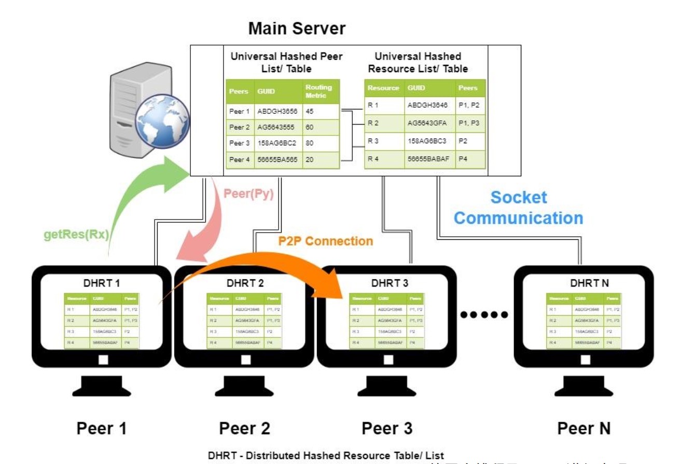

# Peer2Peer-File-Transfer
This a Java project.

Author: Bill-Flash

Time: Nov.2021

## The design of my system:
Most of my designs come from the descriptions on the assignment, but at the same time I have my own innovations in them. I have designed a main server to continuously receive and connect to multiple clients and to respond to client requests, i.e. messages, in order to complete the functionality, and a P2P implementation where the two peers are notified by the server about file sharing sessions. How to implement DHTs will show on Section 4. 
1. Firstly, the client connects to the server and opens a listening thread for the client, I use a validation to see if the client’s name is already in the UHPT to allow the client to connect (reliability). 
2. Secondly, when first connecting, if the client has resources that the other client also has - judged by the absolute pathname - I will combine them in a UHRT peer entry (i.e. show that both clients have them). 
3. Thirdly, the Random class is used to generate a random metric. 
4. Fourthly, the DHRT is generated by passing the type of message (i.e., type) to the client, telling it that this is your DHRT, and at this time the client starts its own sending thread, so that both threads are running at the same time.
5. Fifthly, the server opens a Handler for this new client (i.e., a new thread) to complete the continuous listening at a later stage.
6. Sixth, the client is able to send getRes to request resources from other peers at this point, assuming that the GUIDs of the known resource files are known.
7. Seventh, the server receives the getRes request and finds the optimal peer via the Metric Overlay method, where the Metric Overlay algorithm depends on the smallest randomly generated metric among the peers with common resources as mentioned above (point 3).
8. Eighth, the server sends a message to the best peer to set up the server, and then sends a message to the peer requesting the resource to start trying to connect (here the connection is made continuously until it succeeds, in case the server has not yet been set up successfully, resulting in an error).
9. Ninth, the establishment of the new server and client is done using two new thread classes.
10. Tenth, before P2P is established, the server side checks to see if it has the resource (to prevent miscommunication). If not, the client will end up with a timeout because it has tried to connect several times.
11. Eleventh, after completing the DataInput/OutputStream in P2P, the server side will wait for the client to close the Stream before sending a request to update the UHRT and DHRT.
12. Twelfth, after the update request is completed the two threads end. At this time the main server will update its own UHRT and send it to the thread where the stream listening to the server is located to complete the operation of updating its own DHRT.
13. Thirteenth, during a P2P file transfer, the client will create (if it is the first P2P) a new folder that belongs to it to hold its newly received files. Fourteenth, after multiple P2P transfers, if a file with the same name is about to be transferred in that directory, a suffix is added to its name to prevent an overwrite operation.

## Performance statistics
1.	The time for client receiving the DHRT (establishment times of clients): 38ms – 104ms
2.	The time takes from requesting to finally update DHRT and end up the P2P connection: 19ms(4byte), 159ms(111KB), 361ms(1.1MB), 659(14.3MB), 892ms(44MB), 3045ms(190.7MB), 10042ms(630.3MB), 17296ms(1.16G)

3.	The bandwidth of P2P connection: (b/s)
111KB/19ms = 47858526 b/s
 
## The Pros and Cons of my system
In this section I will describe both the pros and cons of my system. 
1. Firstly, when designing this system, I have adopted the policy that peers cannot be renamed, which prevents other peers from being renamed, but also makes it impossible for a peer to connect to the server under its original name when it disconnects and reconnects (i.e., reconnects after disconnection).
2. Secondly, given that all peers come from the local machine, I use absolute paths to set GUIDs, so that if two peers have the same file before connecting, they can be placed directly in the same resource entry.
3. Thirdly, the server mainly takes a main thread, using a while loop, to keep making peer connections, generating DHRT and transferring back DHRT, and then generating a listening thread to wait for the client to request resources. Note: this thread is always persistent. The advantage of this is that the server is able to handle requests from multiple clients that are online at the same time. In contrast, I designed a total of four threads available on the client side, separating the listening, sending, sub-server and sub-client functions one from the other to appear more parallel.
4. Fourthly, once the listening thread has received a valid connection, it will generate another sending thread, which reduces unnecessary overhead and prevents the sending thread from running all the time.
5. Fifthly, the send thread has been added with an exit function to make the overall design of the system more logical.
6. Sixth, since all P2P port numbers are dynamically assigned, this means that P2P connections, can exist super-multiple.
7. Seventhly, the file names cannot be repeated, giving the peer its own download directory.
8. Eighth, all file paths in DHRT are created dependent on the path of the current file, so that the file can be downloaded correctly after the inheritance of the file share.
9. Ninth, the client cannot detect that the server side has ended midway and can only catch exception to notify reconnect after sending the request.
10. Tenth, since the disconnection of the client cannot be detected in time, the server cannot send the second-best choice to the client that has the resources for the next P2P transfer. Therefore, the client can only be prompted for a timeout.

 
## Rationale for design I made
In this section, I will present any information about the design I have done for this system. 

1. It is not possible to set the same peer’s name, so that the name can be more clearly indicated when alerted.
2. Secondly, the design of absolute paths and the fact that at the time of connection, it is judged to be the same resource as the old entry, and then the peer is added to the old entry, making the allocation of resources more logical and so that the previous entry is not overwritten. the DHTs use a HashMap because of the non-repeating peer names and the fact that even if the absolute path is repeated, the peer can be added to the DHT effectively. Also, this means that two peers own the resource (note: this is even if no sharing is done). This is extremely helpful when sharing resources upfront.
3. Thirdly, the multi-threaded design makes the distribution of functions more reasonable and clearer, without the phenomenon of shared pipes.
4. Fourthly, the waiting mechanism, where the P2P client tries to connect at the beginning of the connection until it is connected. If it times out, the receiving resource thread and request are abandoned. This may be because the client, who is the server, disconnects before receiving the request.
5. Fifth, the sending thread, after the listening thread has received a valid connection, is created. This thread is closed after the exit request is sent.
6. Sixth, my DHRT is a HashMap, the key is a GUID generated from the absolute path of the resource, the value is the absolute path name of the resource and which peers own the resource. Where peer is represented by its GUID, the key in the UHPT is the GUID of the peer, generated according to the name of the peer (this is where the first point mentioned above comes into play), and the value has the name of the peer, the sequence number of the peer and a randomly generated metric. This GUID can then be used to extract the metric to get the best peer, and the Handler can then use the serial number of the current peer to get the output stream of the peer's socket in all sockets to send the file.

